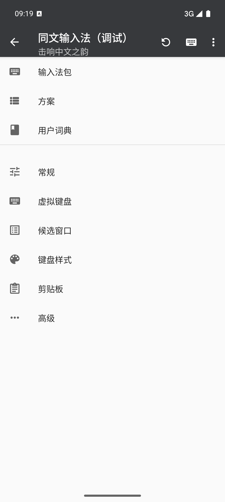
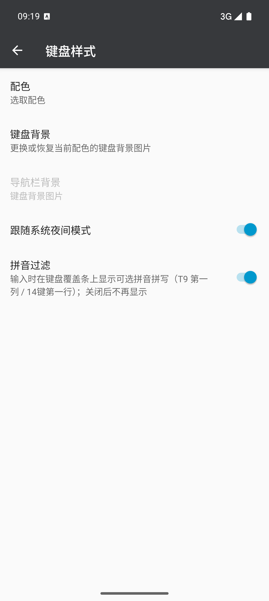
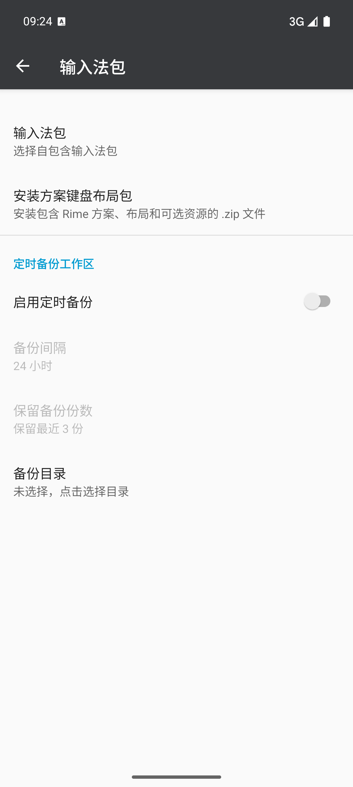
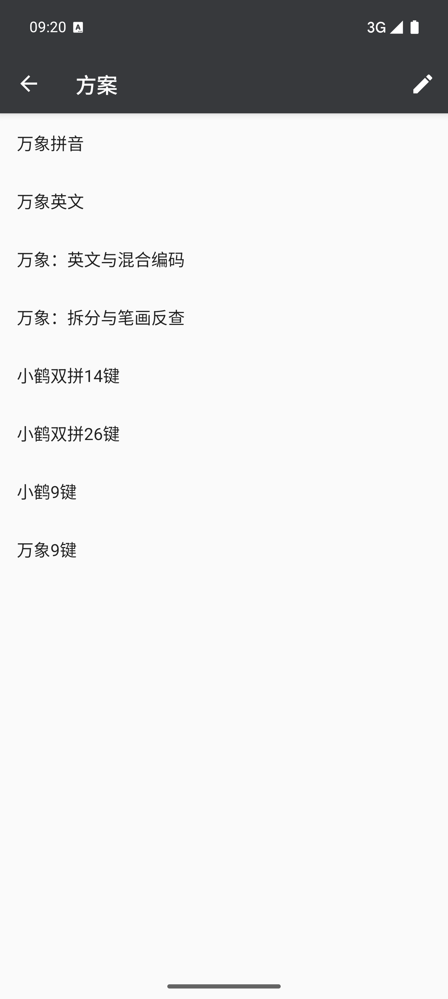

# Trime fork 自定义功能与使用说明

> 本仓库在开源同文输入法（上游 [osfans/trime](https://github.com/osfans/trime)）之上做了一批
> **定制开发**：一部分是为了适配本项目自己的系统限制/包分发形态，一部分是输入体验增强。
> 本文汇总这些“非上游原生”的功能、它们的入口与使用方法，以及包数据再分发时要注意的约定。
> 会话级状态与决策见 `doc/handoff.md`，架构与数据流见 `doc/repo-knowledge.md`。
> 文中界面截图取自模拟器（`com.osfans.trime.debug`），存放于 `doc/assets/`。



---

## 0. 总体约定（为什么是“魔改”而不是改上游）

- **引擎本体只读、JNI 封装按需适配**：上游 `librime`（及 librime-lua/OpenCC）保持**只读消费**；
  但本仓库自有的 **`app/src/main/jni/librime_jni` 封装层**为适配新功能做了**改动/扩展**
  （例如 `remainingInputTail()`、`getKeycodeByName` 等访问器，以及 Rime JNI 查询合并、
  Modified UTF-8/UTF-8 字符串转换等）。因此定制范围 =
  **app（Kotlin）层 + `librime_jni`（JNI 封装）+ 自包含 IME 包数据层**；
  上游 librime 本体遵循 CLAUDE 规则不改（仅从 `librime_jni` 只读消费其声明/`rime_api.h`）。
- **自包含包模型**：每个包自带全部定义（`manifest.yaml` 组装 keyboard/behavior/color/style/
  schema/rime 文件），没有全局预设目录可继承。
- **生成资产与源同步**：音节表/折叠码由 `script/generate_pinyin_syllables.py` 生成，
  `script/extended_validator.py` + `validate-definitions.py --check-shipped` 校验；
  改源后必须同步刷新 zip（见 §5）。
- **schema-first**：数据定义与代码解释不一致时改数据/定义层，不在代码里塞字面量绕过。
- **存储**：工作区/用户数据已迁入**应用内部存储**，**不需要完整存储访问权限**；确需写到
  外部目录的（如备份导出）走 SAF **目录级授权**，仅授予所选目录。
- 完整 26键 小鹤键盘、英文键盘、T9 路径不受下列 14键 定制影响（定制均按方案条件生效）。

---

## 1. 拼音过滤（T9 九键 + 小鹤双拼 14键）

### 解决什么
数字/折叠键一按多义，Rime 候选是多个拼音的并集（如 9键 `426` = gan/gao/han/hao；
14键 `ca` = 中(vs)/擦(ca)）。拼音过滤在键盘上叠一条**可点拼音条**，点选一个拼音即把
确定的小鹤码回填给 Rime，**候选立即收窄**到该拼音——把“翻页挑字”变成“先选音、再选字”。

### 入口与主开关
- **主开关**：设置 → 键盘样式 → **拼音过滤**（默认开），同时控制 T9 与 14键 两处。
- 覆盖位置：T9 键盘叠在第一列（全拼 `wanxiang_t9` / 小鹤双拼九键 `wanxiang_flypy_t9`），
  14键 键盘叠在第一行数字键上方（`wanxiang_14jian`），可横向滑动。



### 使用方法
1. 拼音过滤开；切到对应方案与键盘（14键 需 manifest 默认键盘 `14jian`）。
2. 逐音节按键：键盘上方出现该键位组合的全部合法拼音/音节（如 9键 `426` 给出
   gan/gao/han/hao；14键 `HB` 给出 ge/he/guan/huan）。
3. 点选你想要的拼音 → 候选立刻只剩该音节的字词；继续逐音节点选可整词/整句组码。
4. 退格：回滚上一次点选（撤销确认的那一个音节），再按一次才是普通删除。

### 14键 大写 token 镜像试点（本项目进一步定制）
14键 键盘只发 14 个键位，26 字母折叠后存在“选拼音也收不窄”的结构死点（代表字母版里
`ge` 的折叠码 == 它自己的小鹤码，GE 组 ge/he/guan/huan 永远混在一起）。定制改为：

- **用户可见映射**：键帽显示 Q W…；preedit/回显展示**键位首字母**（QW→Q、ER→E、…、BN→B、M→M），
  与你按的键视觉一致。
- **编码层（“可收窄”的机制）**：键盘实际发送一组**与 a–z 不相交的大写 ASCII token**
  （QW→A、ER→B、…、BN→M、M→N——内部码，非用户可见）；Rime 折叠代数（`/14jian-token`）
  把词典码折进同一 token 空间。因内部码与任何小写双拼码都不相交，点选回填必能收窄。
- 效果：**任何点选都能收窄**——回填的小写双拼码永远不等于键入的 token；
  ge/he/guan/huan 折叠组在 token 版可分别收窄（回填 ge/he/gr/hr）。
- 键入码规范：qu/ju/xu/yu 规范化小鹤码 qv/jv/xv/yv（QW+CV 为 去/区 规范键位）。
- 显示层（`super_comment_preedit.lua`，仅 token 方案生效。A..N 为内部码）：
  - `原编码`：preedit 回显**键位首字母大写**（内部 `A`/`HB` 显示为 `Q`/`GE`），与键帽一致；
  - `有声调/无声调`：完整音节转拼音显示（注释可转时优先）；
  - 残余/无注释 token 自动回显键位首字母，不再出现 A..N 原始字形。
- 单字符键 L/M 通过键级 `key_text_size: 16` 与 Q W 等双字符键字重一致。

### 数据与文件
- 音节表：`<schemaId>.extended.yaml` 的 `t9_disambiguation.syllables`
  （`flypy_14_code` 字母折叠列 + `flypy_14_token` token 列）。
- 生成/校验：
  ```bash
  python3 script/generate_pinyin_syllables.py --flypy14   # 14键表（含 token 列）
  python3 script/generate_pinyin_syllables.py             # T9 表
  python3 script/extended_validator.py <extended.yaml>    # 或 validate-definitions.py --check-shipped
  ```
- 相关代码：`app/.../ime/disambiguation/`（Decoder/Controller/Panel）、
  `data/theme/SchemaExtension.kt`、`CommonKeyboardActionListener`（20000+ 大写键码观察）。

---

## 2. 键盘背景编辑器

### 解决什么
不改包内配色源文件的前提下，为**当前配色方案的日/夜档**单独换键盘背景图；
定制层（`workspace/customization.yaml`）覆盖到解析后的配色上，共享 palette 的多配色互不串扰。

### 入口与使用
1. 设置 → 键盘样式 → **键盘背景**。
2. 预览按真实配色与真实键布局渲染；**日/夜 radio 与预览同组**，跟随当前选择档位实时换肤。
3. 选取图片 → 全屏裁剪（单指平移/双指缩放，固定键盘宽高比）→ 返回预览 → **应用**。
4. **缺省**：只清除当前 配色×档 的自定义背景。
5. 支持按键：选取恒显；应用仅在有待确认裁剪图时出现；缺省仅在当前档已有自定义时出现。

### 数据与文件
- 定制层：`workspace/customization.yaml`（`color_schemes.<id>.light/dark.keyboard_background`）。
- 槽位图：`workspace/backgrounds/custom_<scheme>_<day|night>[._2].png`（双槽交替，应用即生效）。
- 代码：`ui/main/settings/theme/KeyboardBackgroundEditorActivity.kt` 等；预览为纯数据渲染，
  不依赖 Rime 会话（真机已验证 14键↔9键 切换后预览跟随正确键盘）。

---

## 3. 定时备份工作区

### 解决什么
Rime 用户数据/自造词当前已随包**存放在应用内部存储**（无需完整的存储访问权限）；旧的
“周期同步”方案在无网/受限环境下不可靠。改为**定时把整个激活包工作区打成 zip 导出到
用户所选目录**（通过 SAF 目录授权，仅授予该目录），并保留多份、自动清理。

### 入口与使用
入口在 **输入法包 → 定时备份工作区**（同页还有 选择自包含输入法包、安装方案键盘布局包）：

1. **启用定时备份**：开关。
2. **备份间隔**：小时（默认 24）。**保留备份份数**：保留最近 N 份（默认 3）。
3. **备份目录**：点击选择 SAF 目录（未选择时点击可打开目录选择器）。
4. **立即备份**：键盘上的 **Sync 键** 触发一次（未配置目录会提示并跳回“输入法包”设置）。
5. 开启且工作区 >100MB 时弹确认；到保留上限自动清理最旧备份；失败会回写上次状态/时间。



### 数据与文件
- `worker/WorkspaceBackupWorker.kt`（`WorkspaceBackupRunner.runOnce` + 周期 Worker +
  `WorkspaceBackupFiles` 命名/保留）；prefs `AppPrefs.Profile.workspace_backup_*`。
- 备份内容排除 build/编译标记；失败路径会回写 `last_workspace_backup_status/time`。
- 数据/备份均在应用内部空间 + 用户所选 SAF 目录，**不需要完整存储访问权限**。

---

## 4. 自包含 IME 包的安装与再分发约定

入口在 **输入法包** 页：**选择自包含输入法包**（切换当前包）与**安装方案键盘布局包**
（导入 `.zip`，含 Rime 方案、布局与可选资源）；同页还有 §3 的定时备份工作区设置。



1. **重新导入即覆盖安装**：导入 zip 会覆盖当前包工作区并重建 prism/gram，**无需先删除旧包**；
   重复导入是幂等的。仅当遇到异常（如占位/损坏）时才考虑“删包重装”作为排障手段。
2. 仓库约定：
   - `sample_theme_schemas/万象14键-nogram/`（可编辑源）**被 gitignore**；
   - `sample_theme_schemas/万象14键-nogram.zip` **tracked**（改源后必须同步刷新它）；
   - `万象14键.zip`（带 gram 全量包）本地 untracked，按需用同源内容重建（gram 在
     `sample_theme_schemas/wanxiang-lts-zh-hans.gram`）。
   - 刷新后跑 `python3 script/validate-definitions.py --check-shipped`。
3. 数据改动后的自查清单：
   - 生成器/校验器/python 套件（`make python-verifiers`）；
   - `luac -p` 校验改过的 Lua；改动 YAML 可 `safe_load`；
   - 触碰 Kotlin 时 `spotlessApply/Check` + `:app:testDebugUnitTest --offline`；
   - 26键完整小鹤/英文键盘/T9 无回归冒烟。
4. 推送目标：feature 分支推 `origin_home`（Gitea），GitHub 仅同步 develop；详见 CLAUDE.md。

---

## 5. 相关文档/命令速查

| 目的 | 文件/命令 |
|---|---|
| 会话状态/最新决策 | `doc/handoff.md` |
| 仓库架构与数据流 | `doc/repo-knowledge.md` |
| 键盘/组件定义参考 | `doc/Keyboard.md`、`doc/component-model.md`、`doc/definition-schema.md` |
| 全量 python 校验 | `make python-verifiers` |
| shipped 定义校验 | `python3 script/validate-definitions.py --check-shipped` |
| 格式 | `make style-lint` / `make style-apply` |

> 本文随功能演进更新；与上游原生功能的分界以 `doc/handoff.md` 与 git 历史为准。
